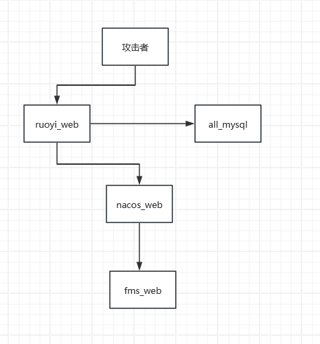
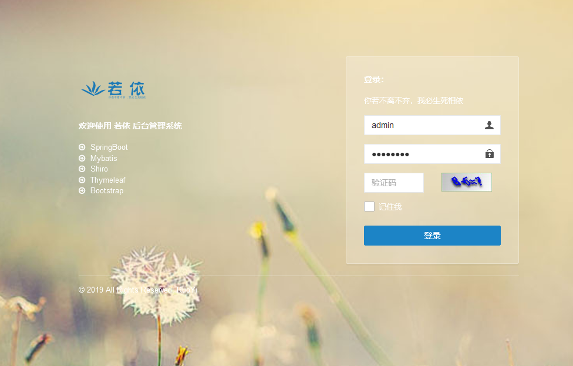
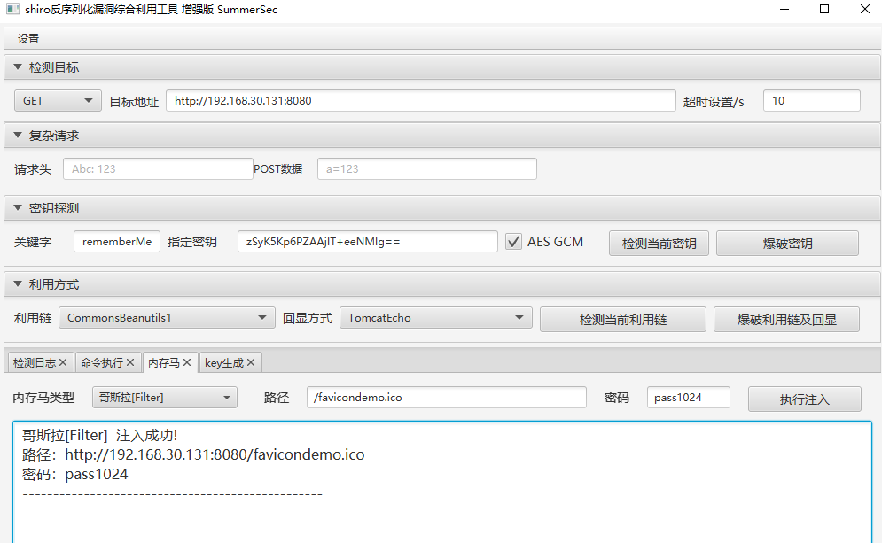
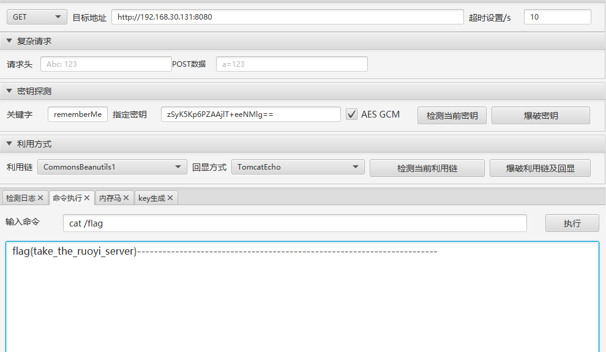
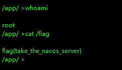
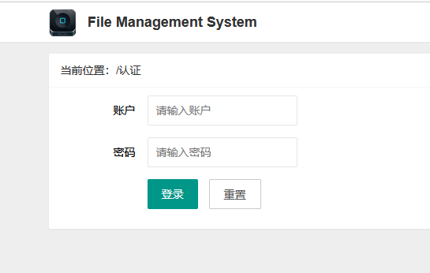

# 2023 铸剑杯
做了很大的改动,变简单了,添加了比赛时没有的udf提权
一共三层四个服务六个flag

- start with ./startup.sh
- shutdown with ./shutdown.sh
- 详细解释blog [记一次docker出全linux的内网渗透题目(仿照2023铸剑杯)](https://www.cnblogs.com/thebeastofwar/p/17955397)
## ruoyi+shiro

## mysql+udf
额外添加的
## nacos+Hessian
- [NacosRce](https://github.com/c0olw/NacosRce)

## fms+log4j

- 还在解决中(没做出来),但是环境搭建出来了
jwt弱口令
如果出现服务器错误把所有cookie删除再刷新试试
